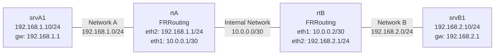

# Demo - ネットワーク構成図

## トポロジー

## ネットワーク一覧

| ネットワーク | アドレス | 用途 |
|---|---|---|
| Network A | 192.168.1.0/24 | srvA1 と rtA を接続 |
| Internal Network | 10.0.0.0/30 | rtA と rtB を接続 (ルータ間リンク) |
| Network B | 192.168.2.0/24 | rtB と srvB1 を接続 |

## ノード一覧

| ノード | イメージ | インターフェース | IPアドレス |
|---|---|---|---|
| rtA | frrouting/frr | eth1 | 10.0.0.1/30 |
|     |               | eth2 | 192.168.1.1/24 |
| rtB | frrouting/frr | eth1 | 10.0.0.2/30 |
|     |               | eth2 | 192.168.2.1/24 |
| srvA1 | alpine | eth1 | 192.168.1.10/24 |
| srvB1 | alpine | eth1 | 192.168.2.10/24 |
