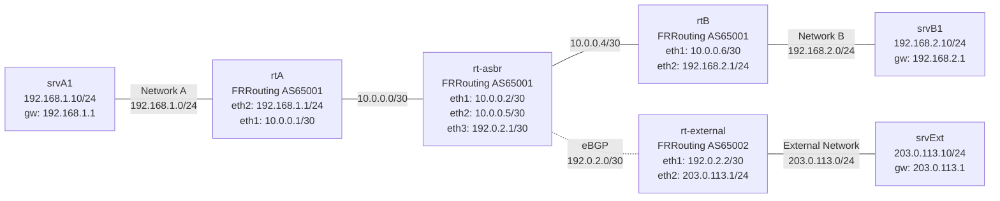

# Demo - ネットワーク構成図

## トポロジー

## ネットワーク一覧

| ネットワーク | アドレス | 用途 |
|---|---|---|
| Network A | 192.168.1.0/24 | srvA1 と rtA を接続 |
| Link rtA--rt-asbr | 10.0.0.0/30 | rtA と rt-asbr を接続 (内部リンク) |
| Link rt-asbr--rtB | 10.0.0.4/30 | rt-asbr と rtB を接続 (内部リンク) |
| BGP Link | 192.0.2.0/30 | rt-asbr と rt-external を接続 (AS境界, TEST-NET-1) |
| AS65001 Global Block | 198.51.100.0/24 | AS65001 のグローバルIPブロック (TEST-NET-2) |
| Network B | 192.168.2.0/24 | rtB と srvB1 を接続 |
| External Network | 203.0.113.0/24 | rt-external と srvExt を接続 |

## ノード一覧

| ノード | イメージ | インターフェース | IPアドレス |
|---|---|---|---|
| rtA | frrouting/frr (AS65001) | eth1 | 10.0.0.1/30 |
|     |                         | eth2 | 192.168.1.1/24 |
| rt-asbr | frrouting/frr (AS65001) | eth1 | 10.0.0.2/30 |
|         |                         | eth2 | 10.0.0.5/30 |
|         |                         | eth3 | 192.0.2.1/30 |
| rtB | frrouting/frr (AS65001) | eth1 | 10.0.0.6/30 |
|     |                         | eth2 | 192.168.2.1/24 |
| rt-external | frrouting/frr (AS65002) | eth1 | 192.0.2.2/30 |
|             |                         | eth2 | 203.0.113.1/24 |
| srvA1 | alpine | eth1 | 192.168.1.10/24 |
| srvB1 | alpine | eth1 | 192.168.2.10/24 |
| srvExt | alpine | eth1 | 203.0.113.10/24 |

## ルーティング設計

| ノード | プロトコル | 詳細 |
|---|---|---|
| rtA | OSPF | 10.0.0.0/30, 192.168.1.0/24 を area 0 でアドバタイズ |
| rt-asbr | OSPF + eBGP | 内部2リンクを OSPF、rt-external と eBGP (AS65001↔AS65002)、BGP→OSPF 再配布、198.51.100.0/24 を BGP でアドバタイズ |
| rtB | OSPF | 10.0.0.4/30, 192.168.2.0/24 を area 0 でアドバタイズ |
| rt-external | eBGP | 172.16.0.0/24 を AS65002 としてアナウンス |
